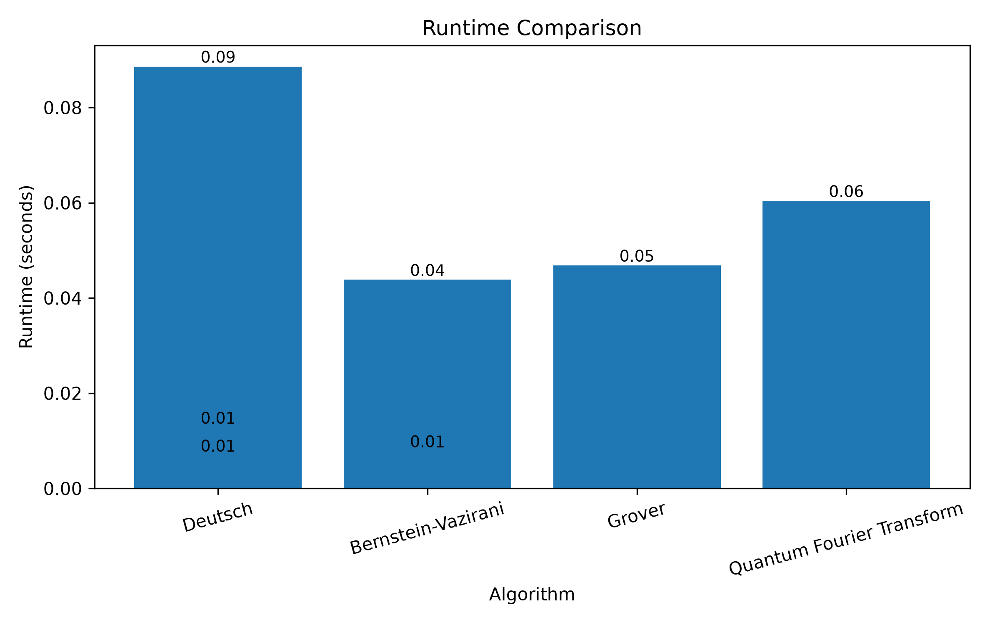
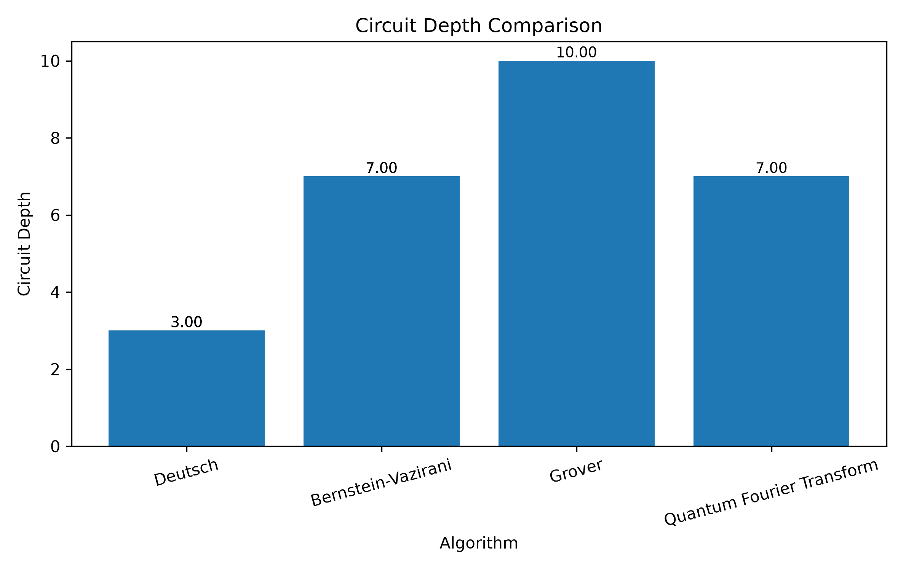
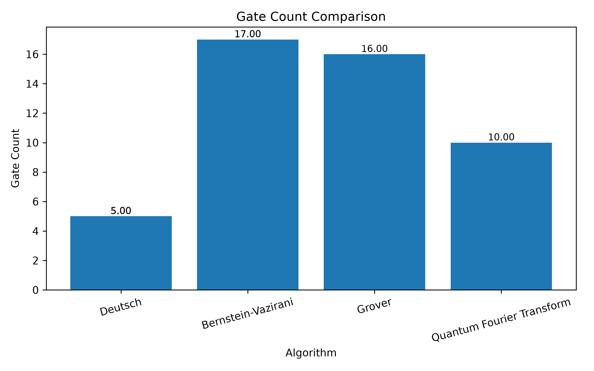

# Quantum Algorithm Benchmarking Framework

A modular benchmarking framework built with **Qiskit** to implement, execute, analyze, and compare fundamental quantum algorithms. The project provides a reusable architecture for benchmarking quantum circuits, collecting execution metrics, exporting benchmark results, and generating visual comparisons.

## Overview

Quantum algorithms are often compared based on theoretical complexity, but practical performance also depends on factors such as circuit depth, gate count, compiler optimizations, and execution characteristics. This framework provides a structured way to benchmark multiple quantum algorithms under a common interface and visualize their performance.

## Features

* Modular architecture using object-oriented design
* Common interface for implementing quantum algorithms
* Implementations of:

  * Deutsch Algorithm
  * Bernstein–Vazirani Algorithm
  * Grover's Search Algorithm
  * Quantum Fourier Transform (QFT)
* Automatic benchmarking pipeline
* Circuit metrics collection

  * Circuit depth
  * Gate count
  * Number of qubits
  * Runtime
  * Transpiled circuit depth
  * Transpiled gate count
  * Gate operation counts
* CSV export of benchmark results
* Automatic generation of comparison plots
* Clean, extensible project structure for adding new algorithms


## Architecture

The framework follows a modular architecture where each component has a single responsibility.

```text
                    +----------------------+
                    |  Quantum Algorithm   |
                    |   (Abstract Base)    |
                    +----------+-----------+
                               |
        +----------------------+----------------------+
        |                      |                      |
   Deutsch               Bernstein-Vazirani       Grover
                                                  |
                                                  |
                                                 QFT

                               |
                               ▼
                     BenchmarkRunner
                               |
             +-----------------+------------------+
             |                                    |
             ▼                                    ▼
      MetricsCollector                     AerSimulator
             |                                    |
             +-----------------+------------------+
                               |
                               ▼
                         Benchmark Results
                               |
                  +------------+-------------+
                  |                          |
                  ▼                          ▼
             CSV Exporter              Visualizer
```

### Component Responsibilities

| Component             | Responsibility                                                                             |
| --------------------- | ------------------------------------------------------------------------------------------ |
| `QuantumAlgorithm`    | Defines the common interface for all quantum algorithms.                                   |
| `BenchmarkRunner`     | Executes algorithms and collects benchmark data.                                           |
| `MetricsCollector`    | Computes circuit metrics such as depth, gate count, runtime, and transpilation statistics. |
| `CSVExporter`         | Stores benchmark results in CSV format.                                                    |
| `BenchmarkVisualizer` | Generates comparison plots from benchmark data.                                            |

This design makes the framework easy to extend. New quantum algorithms can be added by implementing the `QuantumAlgorithm` interface without modifying the benchmarking pipeline.


## Project Structure

```text
quantum-algorithm-benchmark/
│
├── benchmark/
│   ├── algorithms/
│   ├── benchmark.py
│   ├── metrics.py
│   ├── visualization.py
│   ├── export.py
│   └── __init__.py
│
├── scripts/
│   └── run_benchmarks.py
│
├── tests/
│
├── results/
│   ├── csv/
│   └── plots/
│
├── README.md
├── LICENSE
└── requirements.txt
```

## Installation

### Clone the repository

```bash
git clone https://github.com/<your-username>/quantum-algorithm-benchmark.git
cd quantum-algorithm-benchmark
```

### Create a virtual environment (recommended)

```bash
conda create -n qab python=3.12
conda activate qab
```

### Install dependencies

```bash
pip install -r requirements.txt
```

## Usage

Run the complete benchmark suite:

```bash
python -m scripts.run_benchmarks
```

This command will:

* Execute all implemented quantum algorithms
* Collect benchmark metrics
* Export results to CSV
* Generate comparison plots

## Implemented Algorithms

| Algorithm                       | Purpose                                                                                    |
| ------------------------------- | ------------------------------------------------------------------------------------------ |
| Deutsch Algorithm               | Determines whether a Boolean function is constant or balanced with a single query.         |
| Bernstein–Vazirani Algorithm    | Identifies a hidden binary string using a single oracle query.                             |
| Grover's Search Algorithm       | Demonstrates quadratic speedup for unstructured search problems.                           |
| Quantum Fourier Transform (QFT) | Fundamental quantum transform used in many quantum algorithms, including Shor's algorithm. |

## Metrics Collected

For every benchmark, the framework records:

* Circuit depth
* Gate count
* Number of qubits
* Execution runtime
* Transpiled circuit depth
* Transpiled gate count
* Gate operation counts
* Measurement counts

## Technologies Used

* Python
* Qiskit
* Qiskit Aer
* Matplotlib
* CSV
* Git & GitHub


## Benchmark Visualizations

The framework automatically generates benchmark comparison plots after executing the benchmark suite.

### Runtime Comparison



---

### Circuit Depth Comparison



---

### Gate Count Comparison



---

## Sample Workflow

```text
Implement Algorithm
        │
        ▼
Run Benchmark
        │
        ▼
Collect Metrics
        │
        ▼
Export CSV
        │
        ▼
Generate Visualizations
```

---

## Extending the Framework

Adding a new quantum algorithm requires only three steps:

1. Create a new class that inherits from `QuantumAlgorithm`.
2. Implement the `build_circuit()` method.
3. Register the algorithm in `scripts/run_benchmarks.py`.

The benchmarking pipeline, CSV export, and visualization modules work automatically without additional modifications.

---

## Future Work

Planned improvements include:

* Benchmark execution on IBM Quantum hardware
* Noisy simulator benchmarking
* Additional quantum algorithms (QAOA, VQE, Shor's Algorithm, Simon's Algorithm)
* Scalability analysis with increasing qubit counts
* Interactive dashboard for benchmark visualization
* Configurable benchmark profiles
* Continuous Integration (GitHub Actions)

---

## License

This project is released under the MIT License.

---

## Acknowledgements

This project was built using:

* IBM Qiskit
* Qiskit Aer Simulator
* Python
* Matplotlib

Special thanks to the open-source quantum computing community for developing and maintaining these tools.
